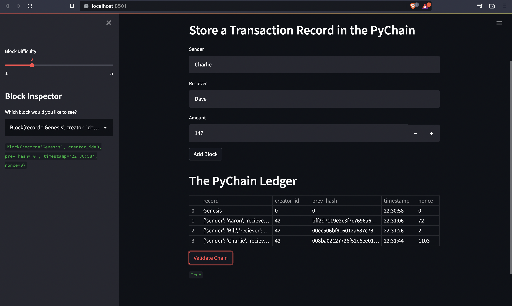

# Module_18
Utilizing streamlit to create a webapp which displays blockchain information. 
This webapp is fairly straightforward. The use of object oriented programming 
to bundle variables and functions together into classes and hashes to ensure 
chain validity.  
This is the finished streamlit application.  

